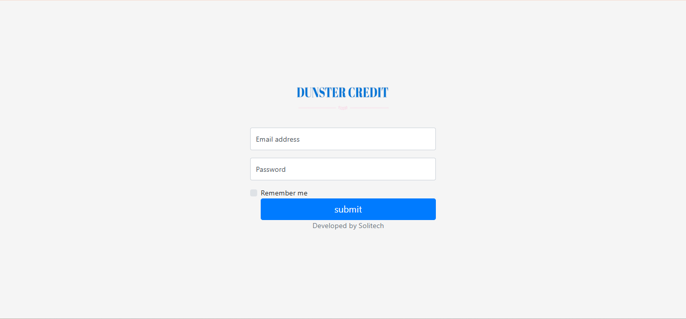
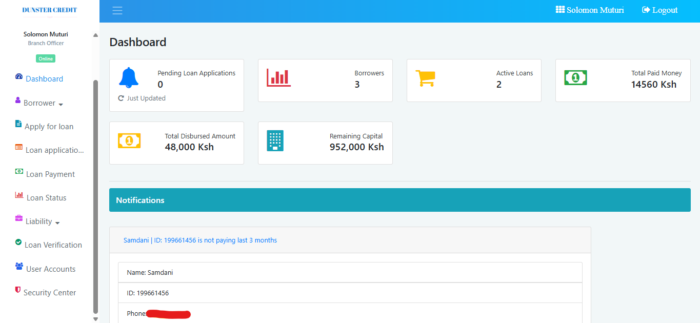
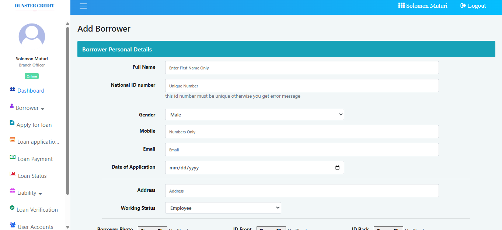
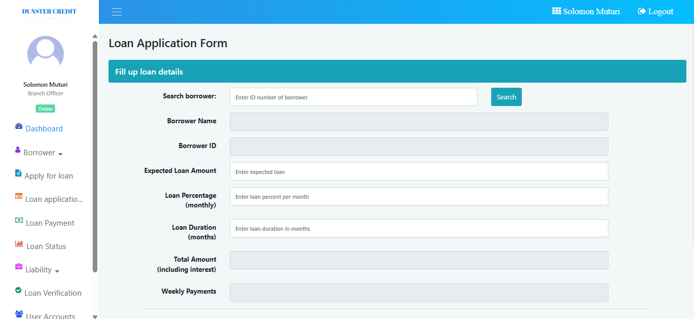
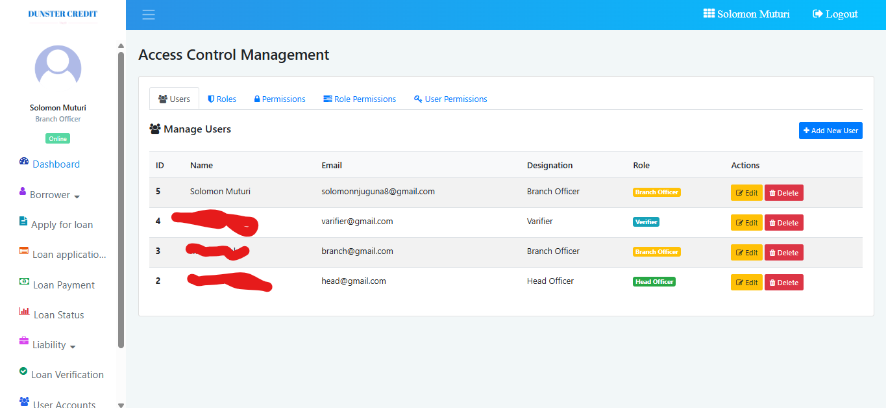

# Loan Management System

A PHP/MySQL micro-credit lending platform for SACCO-style societies and small
financial institutions. It covers the full loan lifecycle — borrower
onboarding, multi-stage application verification, disbursement, repayment
scheduling, arrears monitoring, and collateral recovery — behind a role-based
login.

Built for a local XAMPP/MariaDB stack with no build step and no package manager:
drop the files in `htdocs`, import the schema, and sign in.

---

## Table of contents

- [Screenshots](#screenshots)
- [Features](#features)
- [Loan lifecycle and status codes](#loan-lifecycle-and-status-codes)
- [Roles and access control](#roles-and-access-control)
- [Installation](#installation)
- [Default login](#default-login)
- [Database schema](#database-schema)
- [Financial model](#financial-model)
- [Demonstration data](#demonstration-data)
- [Project layout](#project-layout)
- [Reporting pages](#reporting-pages)
- [Troubleshooting](#troubleshooting)

---

## Screenshots

### Login

`signin.php` — role-based sign-in. Sessions are established in
`libs/Session.php`; every other page calls `Session::checkSession()` and
redirects here if the session is missing.



### Dashboard

`index.php` — the operational summary. Six tiles cover pending applications,
borrower count, active loans, total paid, total disbursed, and undisbursed
capital, followed by an arrears notification panel that surfaces any borrower
more than three months past `next_date`.



The two capital tiles are derived, not hard-coded:

| Tile | Source |
| --- | --- |
| **Total Disbursed Amount** | `SUM(expected_loan) WHERE status = 3` |
| **Undisbursed Capital** *(still in the bank)* | `SUM(expected_loan)` − disbursed |

Undisbursed capital is computed in SQL, so it tracks the data automatically and
cannot drift out of step with the portfolio. It represents capital committed to
approved or in-review applications but not yet lent out.

### Add Borrower

`addborrower.php` — captures identity, contact, next-of-kin, and employment
details. `gender` and `working_status` accept only the values the rest of the
system expects (`Male`/`Female`/`other`, and
`Employee`/`Owner`/`Student`/`Unemployed`/`other`); anything else breaks the
profile and report filters downstream.



### Apply for Loan

`apply_for_loan.php` — the application form. Interest rate, term in months, and
amount are entered here; the total payable, instalment count, and EMI are
calculated live in JavaScript using the same formulas the server enforces, so
what the applicant sees always matches what gets stored.



### Access Control

`manage_users.php` — the "Access Control Management" screen. Five tabs cover
users, roles, permissions, role-to-permission assignment, and direct
user-to-permission overrides.



---

## Features

**Borrowers**

- Add borrowers with full personal, contact, and employment details
- Browse, search, and open an individual borrower profile
- Borrower photo upload

**Loan applications**

- Multi-level verification: Verifier → Branch Officer → Head Officer
- Live EMI / total-payable calculation in the browser
- Application queue with approve, reject, edit, and delete
- Supporting-document upload per application

**Disbursement and repayment**

- Record loan payments against a schedule
- Automatic 30-day due-date advance on each payment
- Running balance, instalment counter, and arrears flag kept in step
- Late-payment fines recorded per instalment
- Loan history and per-loan payment trail

**Collateral and liability**

- Record property or goods pledged as security
- Record an auction sale and settle the balance from the proceeds
- Automatic surplus calculation and refund to the borrower
- Property and settlement reporting

**Reporting**

- Disbursed loans and disbursed totals
- Interest earned
- Payment reports and loan-application reports
- Per-borrower and per-loan drill-downs

**Access control**

- Users, roles, and granular permissions
- Permissions assignable to roles or overridden per user
- Activity logs in the Security Center

**Notifications**

- Borrowers more than three months in arrears are flagged on the dashboard

---

## Loan lifecycle and status codes

`tbl_loan_application.status` drives every stage and every derived report:

| `status` | Meaning |
| --- | --- |
| `0` | Submitted, awaiting verification |
| `1` | Verified by role 1 (Verifier) |
| `2` | Verified by role 2 (Branch Officer) |
| `3` | **Approved and disbursed** |

Once at `status = 3` a loan is further classified by its balance and due date:

| Derived state | Condition |
| --- | --- |
| Completed | `status = 3` and `amount_remain <= 0` |
| Overdue | `status = 3`, `amount_remain > 0`, `next_date <= CURDATE()` |
| Active | `status = 3`, `amount_remain > 0`, `next_date > CURDATE()` |

**Verification is strictly ordered** — a Branch Officer cannot act on an
application still sitting at `status = 0`. Moving a loan to `status = 3` is what
counts as disbursement, so `SUM(expected_loan) WHERE status = 3` is the true
disbursed figure.

---

## Roles and access control

Four roles ship in `tbl_roles`:

| Role | Capability |
| --- | --- |
| Verifier | Verify applications and borrower information |
| Branch Officer | Manage borrowers and process loan applications |
| Head Officer | Manage all operations and generate reports |
| Administrator | Full system access |

Permissions live in `tbl_permissions` and are attached through
`tbl_role_permissions`, with `tbl_user_permissions` available for per-user
overrides. `tbl_user.role` points at `tbl_roles.id`.

---

## Installation

**Requirements**

- XAMPP (or any Apache + PHP 7+ + MariaDB/MySQL stack)
- PHP with the `mysqli` extension enabled

**Steps**

1. Copy the project folder into your web root, e.g. `C:\xampp\htdocs\Loan-Management-System`.
2. Start **Apache** and **MySQL** from the XAMPP control panel.
3. Import the schema. `brac_loan.sql` in the project root is the baseline, but it
   will fail to import as shipped — the `tbl_borrower` definition has a trailing
   comma and quotes the `photo` and `pic` column names. Either fix those three
   spots, or import a corrected dump.
4. Check the credentials in `config/config.php`:

   ```php
   define("DB_HOST", "localhost");
   define("DB_USER", "root");
   define("DB_PASS", "");     // XAMPP default
   define("DB_NAME", "brac_loan");
   ```

   `classes/Database.php` carries a second, independent set of the same
   credentials as hard-coded class properties. Whichever path a page takes,
   both need to be right.

5. Open `http://localhost/Loan-Management-System/` and sign in.

Optionally load the demonstration data (see below).

---

## Default login

| Field | Value |
| --- | --- |
| E-mail | `solomonnjuguna8@gmail.com` |
| Password | `123` |
| Name | Solomon Muturi |
| Designation | Branch Officer |

Passwords are stored as MD5 hashes. This is adequate for a local demo but
**not** for production — see [Troubleshooting](#troubleshooting).

---

## Database schema

Nine tables in the `brac_loan` schema:

| Table | Purpose |
| --- | --- |
| `tbl_borrower` | Borrower personal, contact, and employment details |
| `tbl_loan_application` | Applications, terms, verification status, running balance |
| `tbl_payment` | Repayments with instalment counters and fines |
| `tbl_liability` | Pledged collateral, auction proceeds, settlement, surplus |
| `tbl_user` | Login accounts |
| `tbl_roles` | Role definitions |
| `tbl_permissions` | Granular permission keys |
| `tbl_role_permissions` | Role → permission grants |
| `tbl_user_permissions` | Per-user permission overrides |

Key `tbl_loan_application` columns:

| Column | Meaning |
| --- | --- |
| `b_id`, `name` | Borrower FK, plus a denormalised copy of the borrower name |
| `expected_loan` | Principal requested / disbursed |
| `loan_percentage` | Interest rate per month |
| `installments` | Number of payments — **also the only record of the term** |
| `total_loan` | Principal + interest, the amount repayable |
| `emi_loan` | Instalment amount |
| `amount_paid` / `amount_remain` | Running totals |
| `current_inst` / `remain_inst` | Instalment counters |
| `next_date` | Next due date; `NULL` once settled |
| `files` | Path to the uploaded supporting document |
| `status` | See [lifecycle](#loan-lifecycle-and-status-codes) |

There is **no `months` column** — the term is stored only as `installments`, so
a term in months has to be recovered as `installments / 4`. All monetary columns
are `INT`, and there are no columns for application, approval, or disbursement
dates and none for a reference number.

---

## Financial model

Calculated in JavaScript by `calculateEMI()` in `apply_for_loan.php` and passed
to the insert as hidden fields:

```
total_loan = expected_loan + (expected_loan × loan_percentage ÷ 100) × months
installments = months × 4
emi_loan    = ROUND(total_loan ÷ installments)
```

Simple interest on the original principal for the full term — no amortisation
and no reducing balance. `loan_percentage` is labelled **monthly** in the form
and is applied to every month of the term, which is why a 15% rate over 12
months produces a total payable roughly 2.8× the principal. Rates and terms are
free numeric inputs; nothing in the form constrains them. The demonstration data
uses 5–15% and terms of 1, 2, 3, 4, 6, 9, and 12 months.

The **payment cycle is 30 days**, not one month — the source comment calls them
"weekly" instalments, and `duration_months * 4` treats a month as four of them.
Each repayment advances `next_date` by 30 days from the payment date, so a
4-month term is 16 instalments spread over roughly 16 months.

> `installments`, `total_loan`, and `emi_loan` arrive from the browser and are
> inserted as given — the server does not recompute them. A tampered request can
> therefore store an inconsistent loan. Validate them in `ManageLoan` before
> trusting the figures.

---

## Demonstration data

`demo_data.sql` populates the system with a realistic fictional portfolio so the
reports have something to show. It is safe to import: it only ever inserts, it
continues from the existing maximum IDs, and it leaves user accounts untouched.

**What it loads**

| | |
| --- | --- |
| Borrowers | 40 fictional Kenyan borrowers |
| Loan applications | 69 across 40 borrowers (22 × 1 loan, 10 × 2, 5 × 3, 3 × 4) |
| Repayments | ~570, on a 30-day cycle |
| Collateral settlements | 8 |
| Portfolio principal | **KES 4,000,000** |
| — disbursed (`status = 3`) | KES 3,400,000 |
| — undisbursed, still in the bank | KES 600,000 |

Derived states: 25 completed (17 repaid in cash, 8 settled by collateral), 24
active (17 in progress, 7 not yet due), 10 overdue, 10 pending.

**Import it**

```bash
mysql -u root brac_loan < demo_data.sql
```

or paste it into phpMyAdmin with `brac_loan` selected.

**Verify it**

The file ends with a validation suite, V1–V18. V18 is a data-quality gate where
every row must read `0` — uniqueness, referential integrity, balance arithmetic,
schedule consistency, and date bounds. Re-running V7 reconciles
`cash_collected + cleared_by_collateral = SUM(amount_paid)`.

> The file's `id > 9` / `id > 10` filters separate the demo rows from any
> pre-existing data. Adjust them if your database already holds different rows.

---

## Project layout

```
├── index.php               Dashboard
├── signin.php  signup.php  Authentication
├── addborrower.php         Add borrower
├── viewborrower.php        Borrower profile
├── viewborrowerlist.php    Borrower list
├── apply_for_loan.php      Loan application form
├── loan_application.php    Application queue
├── loanverify.php          Verification
├── individual_verify.php   Single-application verification
├── payloan.php             Record repayment
├── loan_status.php         Loan status
├── activeloans.php         Active loan details
├── loan_history.php        Borrower loan history
├── individual_loan.php     Per-loan payment trail
├── recordsellinfo.php      Record collateral sale
├── showsellinfo.php        Collateral and settlement view
├── manage_users.php        Access control
├── security_center.php     Activity logs
├── newbranch.php           Branch dashboard
├── edit_loan_application.php
├── delete_loan_application.php
├── renew_loan.php
├── classes/
│   ├── Database.php        mysqli connection
│   ├── Employee.php        Borrower queries
│   ├── ManageLoan.php      Loans, payments, totals
│   └── NotificationManager.php
├── libs/
│   ├── Session.php         Session start / check / destroy
│   └── CrudOperation.php   Generic CRUD helper
├── inc/                    header, sidebar, footer
├── config/config.php       DB_HOST, DB_USER, DB_PASS, DB_NAME
├── admin/uploads/          Photos and documents
├── brac_loan.sql           Baseline schema
├── demo_data.sql           Demonstration portfolio
└── migration_roles_permissions.sql
```

---

## Reporting pages

| Page | Report |
| --- | --- |
| `disbursed.php` | All loans disbursed |
| `disbursed_amount.php` | Disbursed totals by branch |
| `interest.php` | Interest earned |
| `payment_report.php` | Payment report |
| `loan_app_report.php` | Loan application report |
| `loan_history.php` | Per-borrower loan history |
| `individual_loan.php` | Per-loan payment trail |
| `showsellinfo.php` | Collateral sales and settlements |
| `security_center.php` | Activity logs |

---

## Troubleshooting

**`tbl_borrower` fails to import**
`brac_loan.sql` has a trailing comma in the `tbl_borrower` column list and
quotes `photo` and `pic`. Remove the quotes and the comma, or import a
corrected dump.

**Blank or stale dashboard tiles**
Check `config/config.php` and the duplicate credentials in
`classes/Database.php`. If the database name differs, the connection fails and
every page goes blank.

**Login rejected**
Passwords are MD5 hashes. To reset one:

```sql
UPDATE tbl_user SET pass = MD5('123') WHERE email = 'solomonnjuguna8@gmail.com';
```

**"Undisbursed Capital" looks wrong**
It is `SUM(expected_loan)` minus the disbursed total, so it changes whenever
applications are added, approved, or rejected. It reflects *committed but
undisbursed* capital, not cash on hand.

**A loan shows the wrong instalment count**
The term is stored only as `installments`, so recover it in months as
`installments / 4`. A value that is not a multiple of four did not come from the
application form.

**Security notes for real deployment**

- Passwords are unsalted MD5. Move to `password_hash()` with bcrypt or Argon2.
- `config/config.php` sits inside the web root and is directly fetchable. Move it
  above `htdocs` or deny access to it in the Apache config.
- The `error_log` and `error_log.txt` files in the project root should not be
  web-reachable; they can leak SQL and paths.
- Add CSRF tokens to the POST forms and set `session_regenerate_id()` on login.
